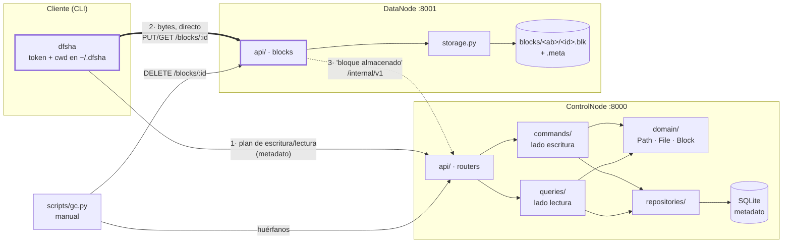

# DFSha — sistema de archivos distribuido por bloques

**Hito 1** · SI3007 / ST0263 Sistemas Distribuidos

DFSha parte archivos en bloques de tamaño fijo, los reparte entre DataNodes y guarda todo
el metadato en un ControlNode. La arquitectura es de tipo HDFS, opción cliente/servidor:
el ControlNode dice *dónde* está cada bloque, pero **los bytes nunca pasan por él** — el
cliente habla directamente con los DataNodes.

Esta etapa entrega RF1 (namespace) y RF2 (transferencia) con un ControlNode y un DataNode,
autenticación JWT, verificación de integridad por bloque con SHA-256 y un recolector
manual de bloques huérfanos.

---

## ⚠️ Validación pendiente

**Los contenedores todavía no se han ejecutado.** Los tres `Dockerfile` y el
`docker-compose.yml` están escritos y revisados, y el YAML parsea, pero nadie ha corrido
aún `docker compose up --build` de principio a fin.

Lo que **sí** está verificado de punta a punta es todo lo demás: las 196 pruebas
automatizadas, y el recorrido completo del arranque rápido (registro, login, `mkdir -p`,
`put` de 50 MB en 50 bloques, `get` con SHA-256 idéntico, `rm` y el ciclo del GC) contra
un ControlNode y un DataNode reales lanzados con `uvicorn` directamente, sin Docker.

Si vas a evaluar la reproducibilidad, empieza por ahí y avísanos del resultado. Esta
sección se borra en cuanto alguien confirme el arranque con Docker.

---

## Arranque rápido

Necesitas Docker y Python 3.11+. Debería llevarte menos de cinco minutos.

### 1. Levantar el clúster

```bash
git clone https://github.com/tsepulvedf/DFSha-Telematica-.git
cd DFSha-Telematica-

cp .env.example .env
```

Abre `.env` y rellena los dos secretos. No tienen valor por defecto: si faltan, los
servicios se niegan a arrancar.

```bash
python -c "import secrets; print('DFSHA_JWT_SECRET=' + secrets.token_urlsafe(48))"
python -c "import secrets; print('DFSHA_INTERNAL_SECRET=' + secrets.token_urlsafe(48))"
```

```bash
docker compose up --build -d
docker compose ps          # los dos servicios en estado healthy
curl http://localhost:8001/health
```

El DataNode se registra solo contra el ControlNode al arrancar, reintentando hasta que
este responde.

### 2. Instalar el cliente

El cliente corre en tu máquina, no en un contenedor. Es el escenario que soporta la
Etapa 1 (ver [Dónde corre el cliente](#dónde-corre-el-cliente)).

```bash
python -m venv .venv
source .venv/bin/activate        # Windows: .venv\Scripts\activate
pip install -e ".[dev]"
```

### 3. Reproducir el round-trip

```bash
export DFSHA_CONTROL_URL=http://localhost:8000

dfsha register ana               # pide la contraseña dos veces
dfsha login ana

dfsha mkdir -p /datos/pruebas
dfsha ls /

# Un archivo de 50 MB con contenido reproducible, sin versionar binarios
python scripts/gen_testfile.py /tmp/original.bin --size 50MB
# anota el sha256 que imprime

dfsha put /tmp/original.bin /datos/pruebas/original.bin
dfsha stat /datos/pruebas/original.bin
dfsha get /datos/pruebas/original.bin /tmp/bajado.bin

sha256sum /tmp/original.bin /tmp/bajado.bin     # deben coincidir
```

Con el tamaño de bloque por defecto (64 MB) ese archivo cabe en un bloque. Para verlo
partido en 50 bloques, levanta el clúster con bloques de 1 MB:

```bash
DFSHA_BLOCK_SIZE=1048576 docker compose up --build -d
```

o pásalo solo para esa subida: `dfsha put --block-size 1048576 ...`.

### 4. Ver el ciclo de borrado y el GC

```bash
dfsha rm /datos/pruebas/original.bin     # borrado lógico: los bloques siguen en disco
curl http://localhost:8001/health        # used_bytes todavía alto

python scripts/gc.py --dry-run           # qué se borraría
python scripts/gc.py                     # borrarlo de verdad

curl http://localhost:8001/health        # used_bytes de vuelta a su valor previo
```

---

## Arquitectura



La línea gruesa es el camino de los datos. Todo lo demás es metadato, y por eso el
ControlNode no es un cuello de botella de ancho de banda: añadir DataNodes en la Etapa 2
suma capacidad de transferencia en lugar de saturar un nodo central.

### Escritura en tres fases

Un bloque, una vez cerrado, es inmutable (WORM). Por eso una escritura no puede ser una
sola llamada:

```mermaid
sequenceDiagram
    participant C as Cliente
    participant N as ControlNode
    participant D as DataNode

    C->>N: POST /files/create {path, size}
    N-->>C: 201 plan: block_ids + a qué DataNode va cada uno<br/>(archivo en WRITING, con expires_at)
    loop cada bloque, hasta --parallel a la vez
        C->>D: PUT /blocks/{id} + X-DFSha-Checksum
        D->>D: verifica SHA-256 y escribe .tmp + os.replace
        D->>N: POST /internal/v1/blocks/{id}/stored
        D-->>C: 201
    end
    C->>N: POST /files/{id}/commit
    N-->>C: 200 {path, size, block_count}<br/>(COMMITTED; la versión anterior pasa a DELETED)
```

Si el cliente se cae en medio, no pasa nada: la reserva vence a los
`DFSHA_WRITE_TTL_SECONDS` y deja de bloquear el nombre. Sus bloques quedan a la vista
del GC.

### Decisiones que explican el código

| Decisión | Consecuencia visible |
|---|---|
| El DataNode no conoce rutas lógicas | `mv` y `rename` son O(1) y no transfieren un solo byte |
| Colocación explícita, no por hash | El ControlNode elige el destino y lo **registra**; añadir nodos no reubica nada |
| WORM con fachada CRUD | Sobrescribir un archivo escribe bloques nuevos; el viejo pasa a `DELETED` en la misma transacción |
| CQRS | `commands/` y `queries/` separados, con trazas distintas, para replicar el lado de lectura en la Etapa 3 |
| Expiración de reservas | Un cliente caído no bloquea un nombre para siempre; es la base de los leases del RF3 |
| Borrado lógico + GC manual | `rm` responde al instante; los bytes se liberan cuando se corre `scripts/gc.py` |

---

## Endpoints

### ControlNode `/api/v1` — lo consume el cliente

| Método | Ruta | Cuerpo / parámetros | Respuesta |
|---|---|---|---|
| `POST` | `/auth/register` | `{username, password}` | `201` |
| `POST` | `/auth/login` | `{username, password}` | `{access_token, expires_in}` |
| `GET` | `/fs/ls` | `?path=/a/b` | `{entries:[{name, type, size, created_at}]}` |
| `GET` | `/fs/stat` | `?path=/a/b/c` | `{path, type, size, block_size, block_count, created_at}` |
| `POST` | `/fs/mkdir` | `{path, parents}` | `201` |
| `DELETE` | `/fs/rmdir` | `?path=&recursive=` | `204` |
| `DELETE` | `/fs/rm` | `?path=` | `204` |
| `POST` | `/fs/mv` | `{src, dst}` | `204` |
| `POST` | `/files/create` | `{path, size, block_size?}` | `201 {file_id, block_size, expires_at, blocks:[…]}` |
| `POST` | `/files/{file_id}/commit` | — | `200 {path, size, block_count}` · `409` si falta algún bloque · `410` si la reserva venció |
| `POST` | `/files/{file_id}/abort` | — | `204` |
| `GET` | `/files/open` | `?path=/a/b/c` | `{file_id, size, block_size, blocks:[…]}` |

Todo salvo `/auth/*` exige `Authorization: Bearer <token>`.

### ControlNode `/internal/v1` — DataNode y GC

Exige la cabecera `X-DFSha-Internal-Secret`. En la Etapa 3 pasa a gRPC con mTLS.

| Método | Ruta | Cuerpo | Respuesta |
|---|---|---|---|
| `POST` | `/datanodes/register` | `{base_url, capacity_bytes}` | `{data_node_id}` |
| `POST` | `/blocks/{block_id}/stored` | `{data_node_id, size, checksum_sha256}` | `204` |
| `GET` | `/gc/orphan-blocks` | — | `{blocks:[{block_id, size, replicas:[…]}]}` |
| `POST` | `/gc/confirm` | `{block_ids:[…]}` | `204` |

### DataNode `/api/v1` — lo consume el cliente

| Método | Ruta | Detalle |
|---|---|---|
| `PUT` | `/blocks/{block_id}` | Bytes crudos + `X-DFSha-Checksum`. `201`; `422` si el checksum no cuadra; `409` si el bloque ya existe |
| `GET` | `/blocks/{block_id}` | Bytes crudos + `X-DFSha-Checksum` |
| `DELETE` | `/blocks/{block_id}` | `204`, idempotente |
| `GET` | `/health` | `{status, used_bytes, capacity_bytes, block_count, disk_free_bytes, data_node_id}` |

Los bloques son inmutables: reescribir un `block_id` existente es `409`, nunca una
sobrescritura.

Documentación interactiva: <http://localhost:8000/docs> y <http://localhost:8001/docs>.

---

## Cliente

```
dfsha register <usuario>              dfsha ls [ruta]          dfsha put <local> <remoto>
dfsha login <usuario>                 dfsha cd <ruta>          dfsha get <remoto> <local>
dfsha logout                          dfsha pwd                dfsha stat <ruta>
dfsha mkdir [-p] <ruta>               dfsha rm <ruta>          dfsha mv <origen> <destino>
dfsha rmdir [-r] <ruta>
```

- `cd` y `pwd` operan sobre un directorio de trabajo **del lado del cliente**, guardado
  junto al token en `~/.dfsha/session.json`. El ControlNode es stateless.
- `put` y `get` aceptan `--parallel N` (por defecto 4) para transferir bloques a la vez.
- `-v` emite los logs JSON de tiempos por stdout.

> **Git Bash en Windows**: MSYS reescribe los argumentos que empiezan por `/` y convierte
> `/datos/pruebas` en `C:/Program Files/Git/datos/pruebas` antes de que la CLI los vea.
> Usa PowerShell, CMD o WSL, o antepón una barra más: `dfsha cd //datos/pruebas`.

### Dónde corre el cliente

**La Etapa 1 soporta el cliente en el host.** Es el escenario del arranque rápido y el
único verificado de punta a punta.

Hay que elegir porque los bytes viajan directos entre cliente y DataNode: el ControlNode
se limita a repetirle al cliente la URL con la que el DataNode se registró, y un solo
DataNode solo puede registrar una. "Alcanzable" significa cosas distintas desde el host y
desde dentro de la red de compose, y ninguna URL sirve para las dos.

El interruptor es una sola variable, y va **siempre en el servicio `data-node-1`**:

| Escenario | `DFSHA_DATANODE_BASE_URL` en `data-node-1` | Estado |
|---|---|---|
| Cliente en el host | `http://localhost:8001` | **Soportado** (por defecto) |
| Cliente en un contenedor | `http://data-node-1:8001` | Limitación conocida, ver abajo |

No sirve de nada ponerla en el servicio `client`: el cliente nunca lee esa variable,
recibe la `base_url` dentro del plan que le devuelve el ControlNode.

#### Limitación conocida: el servicio `client` de compose

Con la configuración por defecto, desde `docker compose run --rm client …` funcionan solo
los comandos de namespace —`ls`, `mkdir`, `rmdir`, `rm`, `mv`, `stat`, `cd`, `pwd`—, que
son metadato puro contra el ControlNode.

`put`, `get` y `scripts/gc.py` **fallan ahí** con un error de conexión, porque el plan
trae `http://localhost:8001` y dentro de ese contenedor `localhost` es el propio
contenedor del cliente. El síntoma es un fallo en el primer bloque, no un error de
autenticación ni de ruta.

Para transferir desde un contenedor hay que cambiar de escenario, y entonces deja de
funcionar el cliente del host:

```bash
DFSHA_DATANODE_BASE_URL=http://data-node-1:8001 docker compose up -d --build
```

Corre el GC desde el host, que es donde sí funciona en ambos casos:

```bash
export DFSHA_CONTROL_URL=http://localhost:8000
export DFSHA_INTERNAL_SECRET=...   # el mismo valor que en .env
python scripts/gc.py
```

Esto no es una carencia que haya que arreglar en la Etapa 1: con N DataNodes, la Etapa 2
lo resuelve en el sitio correcto, haciendo que el ControlNode anuncie a cada cliente la
dirección visible desde donde está.

---

## Configuración

Todo por variables de entorno; `.env.example` las lista todas.

| Variable | Por defecto | Para qué |
|---|---|---|
| `DFSHA_BLOCK_SIZE` | `67108864` (64 MB) | Tamaño de bloque |
| `DFSHA_CONTROL_URL` | `http://localhost:8000` | Dónde está el ControlNode |
| `DFSHA_DB_URL` | `sqlite:///./dfsha.db` | Metadato |
| `DFSHA_JWT_SECRET` | — **obligatorio** | Firma de los tokens |
| `DFSHA_JWT_TTL_SECONDS` | `3600` | Vida del token |
| `DFSHA_INTERNAL_SECRET` | — **obligatorio** | Protege `/internal/v1` |
| `DFSHA_DATA_DIR` | `/var/lib/dfsha` | Dónde guarda bloques el DataNode |
| `DFSHA_DATANODE_BASE_URL` | `http://localhost:8001` | URL con la que se anuncia el DataNode |
| `DFSHA_DATANODE_CAPACITY_BYTES` | libre en disco | Capacidad anunciada |
| `DFSHA_WRITE_TTL_SECONDS` | `600` | Vencimiento de las reservas de escritura |
| `DFSHA_LOG_LEVEL` | `INFO` | Nivel de log |

Los dos secretos **no tienen valor por defecto en el código** y deben tener al menos 16
caracteres. Un secreto por defecto en un repositorio público es un hallazgo de seguridad.

---

## Logs

Una línea JSON por evento a stdout, con `timestamp`, `level`, `service`, `event` y
`duration_ms`. No son decorativos: son los datos de los benchmarks de la Etapa 4.

```bash
docker compose logs -f control-node | jq 'select(.event | startswith("metadata"))'
dfsha -v put /tmp/original.bin /datos/x.bin | jq 'select(.event == "block.upload")'
```

| Evento | Campos propios |
|---|---|
| `block.upload` / `block.download` | `block_id`, `size_bytes`, `data_node_id`, `ok` |
| `file.put` / `file.get` | `file_id`, `size_bytes`, `block_count`, `parallel` |
| `metadata.command` / `metadata.query` | `operation` |

La separación CQRS se ve en las trazas: los comandos y las consultas emiten eventos
distintos.

---

## Pruebas

```bash
pip install -e ".[dev]"
pytest -q                      # toda la suite
pytest tests/unit -q           # rápido, sin red
pytest tests/integration -q    # levanta ControlNode y DataNode reales en puertos reales
```

Las de integración arrancan servidores uvicorn de verdad en hilos y usan el cliente real,
para ejercitar el camino que un cliente simulado se saltaría: metadato contra el
ControlNode, bytes contra el DataNode.

Cubren, entre otros: round-trip de 50 MB en 50 bloques con SHA-256 idéntico, archivo
vacío y de un byte, checksum incorrecto rechazado con `422` y `commit` fallando con
`409`, aislamiento entre usuarios, `mv` sin tocar el DataNode, reserva vencida con `410`,
y el ciclo completo del GC con `used_bytes` restaurado.

---

## Estructura

```
src/dfsha/
├── common/          DTOs compartidos, checksum, errores, logging
├── control_node/
│   ├── api/         routers: sólo traducción HTTP ↔ casos de uso
│   ├── commands/    lado escritura (CQRS)
│   ├── queries/     lado lectura (CQRS)
│   ├── domain/      Path, File, Block, reglas, partición
│   ├── repositories/  modelos SQLAlchemy, interfaces, unidad de trabajo
│   └── services/    auth, placement, resolver
├── data_node/       storage.py (layout en disco) + api/
└── client/          cli.py, session.py, chunker.py, transfer.py
scripts/             gc.py, gen_testfile.py
tests/               unit/, integration/
```

`CLAUDE.md` guarda las decisiones de diseño, la hoja de ruta por etapas y los contratos.

---

## Alcance de esta etapa

**Entra**: RF1, RF2, JWT, SHA-256 por bloque, un ControlNode y un DataNode, GC manual,
logging estructurado.

**No entra, y llega después**: replicación (aquí R=1), pipeline entre DataNodes,
heartbeats y block reports, gRPC, mTLS, cifrado en reposo, alta disponibilidad del
ControlNode, RF3 con leases. La Etapa 2 añade N DataNodes con *power of d choices*; la
Etapa 3, replicación R=3 y alta disponibilidad.

El diseño ya soporta N nodos sin refactor: `block_replicas` tiene cardinalidad N,
`data_nodes` es una tabla con estado y capacidad, la colocación está detrás de
`BlockPlacementPolicy`, y los planes que el ControlNode devuelve al cliente ya son listas
de réplicas por bloque — hoy con un solo elemento.
