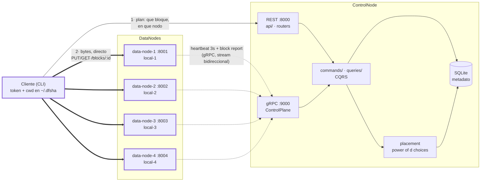

# DFSha — sistema de archivos distribuido por bloques

**Hito 2** · SI3007 / ST0263 Sistemas Distribuidos

DFSha parte archivos en bloques de tamaño fijo, los reparte entre DataNodes y guarda todo
el metadato en un ControlNode. La arquitectura es de tipo HDFS, opción cliente/servidor:
el ControlNode dice *dónde* está cada bloque, pero **los bytes nunca pasan por él** — el
cliente habla directamente con los DataNodes.

El **Hito 1** entregó RF1 (namespace) y RF2 (transferencia) con un ControlNode y un
DataNode, autenticación JWT, integridad por bloque con SHA-256 y un recolector manual de
bloques huérfanos.

El **Hito 2** pasa a **N DataNodes reales**: un plano de control propio sobre gRPC con
heartbeats cada 3 s, detección de caídas en segundos, y una política de colocación
*power of d choices* que reparte los bloques según la carga real de cada nodo y su
dominio de falla.

---

## Arranque rápido

Necesitas Docker y Python 3.11+. Debería llevarte menos de cinco minutos.

### 1. Crear el `.env` — obligatorio antes de nada

`docker compose up` **aborta** si no existe `.env` con los dos secretos rellenos:

```
falta DFSHA_JWT_SECRET; copia .env.example a .env
```

Es a propósito: los secretos no tienen valor por defecto en el código, porque uno por
defecto en un repositorio público es un hallazgo de seguridad.

```bash
git clone https://github.com/tsepulvedf/DFSha-Telematica-.git
cd DFSha-Telematica-
```

**bash / zsh / WSL:**

```bash
cp .env.example .env
sed -i "s|^DFSHA_JWT_SECRET=$|DFSHA_JWT_SECRET=$(python -c 'import secrets;print(secrets.token_urlsafe(48))')|" .env
sed -i "s|^DFSHA_INTERNAL_SECRET=$|DFSHA_INTERNAL_SECRET=$(python -c 'import secrets;print(secrets.token_urlsafe(48))')|" .env

grep -E '^DFSHA_(JWT|INTERNAL)_SECRET=.+' .env    # deben salir dos líneas con valor
```

**PowerShell:**

```powershell
Copy-Item .env.example .env
$jwt = python -c "import secrets;print(secrets.token_urlsafe(48))"
$int = python -c "import secrets;print(secrets.token_urlsafe(48))"
(Get-Content .env) -replace '^DFSHA_JWT_SECRET=$', "DFSHA_JWT_SECRET=$jwt" -replace '^DFSHA_INTERNAL_SECRET=$', "DFSHA_INTERNAL_SECRET=$int" | Set-Content .env

Select-String -Path .env -Pattern '^DFSHA_(JWT|INTERNAL)_SECRET=.+'   # deben salir dos
```

Rellenan las dos líneas vacías en su sitio, sin duplicar claves. En macOS el `sed -i`
del sistema pide un argumento: usa `sed -i ''` en lugar de `sed -i`.

`.env` está en `.gitignore`. No lo subas nunca.

### 2. Levantar el clúster

```bash
docker compose up --build -d
docker compose ps          # control-node y data-node-1..4
curl http://localhost:8001/health
```

Son cinco servicios: el ControlNode (8000 REST, 9000 gRPC) y cuatro DataNodes en
8001–8004, cada uno con su volumen y su dominio de falla (`local-1`…`local-4`).

Cada DataNode se registra solo por gRPC al arrancar, reintentando hasta que el
ControlNode responde, y a partir de ahí late cada 3 s.

### 3. Instalar el cliente

El cliente corre en tu máquina, no en un contenedor. Es el escenario que soporta la
Etapa 1 (ver [Dónde corre el cliente](#dónde-corre-el-cliente)).

```bash
python -m venv .venv
source .venv/bin/activate        # Windows: .venv\Scripts\activate
pip install -e ".[dev]"
```

### 4. Reproducir el round-trip

```bash
export DFSHA_CONTROL_URL=http://localhost:8000

dfsha register ana               # pide la contraseña dos veces
dfsha login ana

dfsha cluster                    # los cuatro DataNodes, ALIVE, con su dominio

dfsha mkdir -p /datos/pruebas
dfsha ls /

# Un archivo de 50 MB con contenido reproducible, sin versionar binarios
python scripts/gen_testfile.py /tmp/original.bin --size 50MB
# anota el sha256 que imprime

dfsha put /tmp/original.bin /datos/pruebas/original.bin
dfsha stat /datos/pruebas/original.bin
dfsha get /datos/pruebas/original.bin /tmp/bajado.bin

sha256sum /tmp/original.bin /tmp/bajado.bin     # deben coincidir
```

Con el tamaño de bloque por defecto (64 MB) ese archivo cabe en un bloque. Para verlo
partido en 50 bloques, pásalo en la subida:

```bash
dfsha put --block-size 1048576 /tmp/original.bin /datos/pruebas/original.bin
dfsha stat /datos/pruebas/original.bin     # bloques: 50
dfsha cluster                              # los 50 repartidos entre los cuatro nodos
```

En `dfsha cluster` se ve el reparto: ningún nodo se lleva más de una fracción de los 50
bloques. Esa es la política de colocación funcionando, no el azar.

O levanta el clúster entero con bloques de 1 MB: `DFSHA_BLOCK_SIZE=1048576 docker compose
up --build -d`.

### 5. Ver el ciclo de borrado y el GC

Corre el GC **desde la raíz del repositorio**: lee `DFSHA_INTERNAL_SECRET` del entorno y,
si no está, del `.env` que creaste en el paso 1. No hace falta exportar nada.

```bash
dfsha rm /datos/pruebas/original.bin     # borrado lógico: los bloques siguen en disco
curl http://localhost:8001/health        # used_bytes todavía alto, block_count intacto

python scripts/gc.py --dry-run           # lista los huérfanos sin borrar nada
python scripts/gc.py                     # borrarlos de verdad

curl http://localhost:8001/health        # used_bytes y block_count de vuelta a cero
```

Si lo ejecutas desde otro directorio no encontrará el `.env`, y entonces sí hay que
pasarle el secreto:

```bash
export DFSHA_INTERNAL_SECRET=...              # bash: el mismo valor que en .env
$env:DFSHA_INTERNAL_SECRET = "..."            # PowerShell
python scripts/gc.py --internal-secret ...    # o directamente por argumento
```

---

## Arquitectura



La línea gruesa es el camino de los datos; la punteada, el plano de control. El
ControlNode no es un cuello de botella de ancho de banda: cada DataNode que se añade suma
capacidad de transferencia en lugar de saturar un nodo central.

### Por qué gRPC solo en el plano de control

Es una decisión razonada, no una concesión a medias, y es material del informe.

| | Plano de control (ControlNode↔DataNode) | Plano de datos y cliente |
|---|---|---|
| **Transporte** | **gRPC** | **REST** |
| Cómo es el tráfico | mensajes pequeños, frecuentes (uno cada 3 s por nodo), de esquema fijo | bytes crudos, transferencias grandes y esporádicas |
| Qué se gana | Protobuf y HTTP/2: menos bytes, conexión persistente, contrato con tipos que el compilador revisa | depurable con `curl`, herramientas HTTP estándar, API legible |

Tres RPC viajan por gRPC: `Register`, `Heartbeat` (stream bidireccional) y `BlockReport`.

**`POST /internal/v1/blocks/{block_id}/stored` se queda en REST**, y la razón importa: el
DataNode la llama de forma síncrona antes de responder `201` al cliente, de modo que
cuando el cliente ve su bloque subido, el ControlNode ya lo sabe. Si esa confirmación
viajara en el block report del heartbeat, un `commit` inmediato podría adelantarse hasta
3 s a la noticia y fallar con `409` por una carrera. La latencia del commit no puede
quedar atada al periodo del latido.

### Estado de un DataNode

El estado se **deriva** del último heartbeat cada vez que se consulta, no se lee de una
columna que alguien tenga que acordarse de actualizar. Así no puede quedar
desincronizado.

| Estado | Cuándo | En la colocación | Sus réplicas |
|---|---|---|---|
| `ALIVE` | latido en los últimos 10 s | candidato | legibles |
| `SUSPECT` | sin latir 10 s | **fuera** | **siguen legibles** |
| `DEAD` | sin latir 30 s | fuera | marcadas `MISSING` |

Que `SUSPECT` no toque las réplicas es lo que evita que un hipo de red cueste una
re-replicación entera cuando llegue la Etapa 3.

Los tres umbrales son configurables, y **son agresivos a propósito**: con un latido cada
3 s, 10 s son tres perdidos y 30 s son diez. Se eligieron para que la transición quepa en
la demostración del hito; en producción serían mucho más largos, porque declarar muerto a
un nodo vivo es caro.

**Reincorporación por `boot_id`.** El `boot_id` se guarda en `node.json`, dentro del mismo
volumen que los bloques, y eso es el mecanismo, no un detalle: si el nodo vuelve con el
mismo `boot_id`, conserva su disco y sus réplicas se recuperan tras el primer report
completo; si vuelve con otro, perdió el volumen y sus réplicas pasan a `MISSING`, porque
los bytes ya no están.

### Cómo se elige el DataNode de cada bloque

`LeastLoadedPlacement`, en este orden:

1. **Filtrar**: solo `ALIVE` con `disk_free_bytes ≥ block_size + DFSHA_MIN_FREE_BYTES`.
2. **Ordenar** por ocupación (`used/capacity`), desempatando por escrituras en vuelo.
3. **Elegir al azar entre los `d` primeros** (d=3), no el primero. Coger siempre el más
   vacío provoca efecto manada: todas las escrituras concurrentes van al mismo nodo hasta
   el siguiente heartbeat, que es cuando el ControlNode se entera de que ya no está vacío.
4. **Dominios de falla**: cada réplica en un dominio distinto. Si no quedan libres, se
   relaja con un aviso (`placement.domain_relaxed`), pero **nunca dos réplicas en el mismo
   nodo**: dos copias en el mismo disco se pierden juntas.

Si no hay candidatos suficientes, el error dice cuántos se pidieron, cuántos había y por
qué se descartó cada nodo. Nunca se colocan en silencio menos réplicas de las pedidas.

La carga sale del **último heartbeat**, no del contador del ControlNode, que es solo una
caché. Y la política cuenta lo que ya asignó dentro de la misma llamada: sin eso, los 50
bloques de un `put` se colocarían con una única foto de carga y, con `d=3` y cuatro nodos
iguales, el cuarto no entraría en la ventana ni una sola vez.

### Divergencia: el ControlNode nunca borra datos

| Situación | Qué hace |
|---|---|
| El nodo reporta un bloque que el metadato no conoce | huérfano: se registra y queda para el GC |
| El metadato espera un bloque que el nodo no reporta | la réplica pasa a `MISSING` y se registra |

La asimetría es deliberada: un bloque de más cuesta disco, uno de menos cuesta datos. Ante
la duda, el sistema se queda con el bloque y avisa a un humano.

**Un report incremental nunca marca `MISSING`.** En un incremental el nodo manda solo lo
que cambió; que un bloque no aparezca significa que no se tocó, no que no esté. Solo un
report completo autoriza a concluir que falta algo. El ControlNode pide uno al abrir cada
stream de heartbeat, porque justo tras una reconexión es cuando su visión puede haber
quedado vieja.

### Escritura en tres fases

Un bloque, una vez cerrado, es inmutable (WORM). Por eso una escritura no puede ser una
sola llamada:

```mermaid
sequenceDiagram
    participant C as Cliente
    participant N as ControlNode
    participant D as DataNode

    C->>N: POST /files/create {path, size}
    N-->>C: 201 plan: block_ids + a qué DataNode va cada uno<br/>(archivo en WRITING, con expires_at)
    loop cada bloque, hasta --parallel a la vez
        C->>D: PUT /blocks/{id} + X-DFSha-Checksum
        D->>D: verifica SHA-256 y escribe .tmp + os.replace
        D->>N: POST /internal/v1/blocks/{id}/stored
        D-->>C: 201
    end
    C->>N: POST /files/{id}/commit
    N-->>C: 200 {path, size, block_count}<br/>(COMMITTED; la versión anterior pasa a DELETED)
```

Si el cliente se cae en medio, no pasa nada: la reserva vence a los
`DFSHA_WRITE_TTL_SECONDS` y deja de bloquear el nombre. Sus bloques quedan a la vista
del GC.

### Decisiones que explican el código

| Decisión | Consecuencia visible |
|---|---|
| El DataNode no conoce rutas lógicas | `mv` y `rename` son O(1) y no transfieren un solo byte |
| Colocación explícita, no por hash | El ControlNode elige el destino y lo **registra**; añadir nodos no reubica nada |
| WORM con fachada CRUD | Sobrescribir un archivo escribe bloques nuevos; el viejo pasa a `DELETED` en la misma transacción |
| CQRS | `commands/` y `queries/` separados, con trazas distintas, para replicar el lado de lectura en la Etapa 3 |
| Expiración de reservas | Un cliente caído no bloquea un nombre para siempre; es la base de los leases del RF3 |
| Borrado lógico + GC manual | `rm` responde al instante; los bytes se liberan cuando se corre `scripts/gc.py` |

---

## Endpoints

### ControlNode `/api/v1` — lo consume el cliente

| Método | Ruta | Cuerpo / parámetros | Respuesta |
|---|---|---|---|
| `POST` | `/auth/register` | `{username, password}` | `201` |
| `POST` | `/auth/login` | `{username, password}` | `{access_token, expires_in}` |
| `GET` | `/cluster/status` | — | `{nodes:[…], replication_factor, suspect_after_ms, dead_after_ms}` |
| `GET` | `/fs/ls` | `?path=/a/b` | `{entries:[{name, type, size, created_at}]}` |
| `GET` | `/fs/stat` | `?path=/a/b/c` | `{path, type, size, block_size, block_count, created_at}` |
| `POST` | `/fs/mkdir` | `{path, parents}` | `201` |
| `DELETE` | `/fs/rmdir` | `?path=&recursive=` | `204` |
| `DELETE` | `/fs/rm` | `?path=` | `204` |
| `POST` | `/fs/mv` | `{src, dst}` | `204` |
| `POST` | `/files/create` | `{path, size, block_size?}` | `201 {file_id, block_size, expires_at, blocks:[…]}` |
| `POST` | `/files/{file_id}/commit` | — | `200 {path, size, block_count}` · `409` si falta algún bloque · `410` si la reserva venció |
| `POST` | `/files/{file_id}/abort` | — | `204` |
| `GET` | `/files/open` | `?path=/a/b/c` | `{file_id, size, block_size, blocks:[…]}` |

Todo salvo `/auth/*` exige `Authorization: Bearer <token>`.

### ControlNode, plano de control — gRPC `:9000`

Solo lo consume el DataNode. Definición en
[`control.proto`](src/dfsha/common/proto/control.proto); el código se genera con
`python scripts/gen_proto.py` y no se versiona.

| RPC | Tipo | Para qué |
|---|---|---|
| `Register` | unario | Alta del nodo: URL anunciada, dominio de falla, `boot_id`, capacidad |
| `Heartbeat` | **stream bidireccional** | Latido cada 3 s con métricas y report incremental. El ControlNode responde `Ack` y, si su visión no cuadra, `FullReportReq` |
| `BlockReport` | unario | Report completo, fuera de banda porque puede ser grande |

El stream es bidireccional desde ya aunque hoy el ControlNode solo empuje esos dos
mensajes: es por donde la Etapa 3 mandará las órdenes de re-replicación, y añadirlas será
un caso más en el `oneof`, no rehacer el transporte.

### ControlNode `/internal/v1` — DataNode y GC

Exige la cabecera `X-DFSha-Internal-Secret`, comparada en tiempo constante. En la Etapa 3
pasa a mTLS.

| Método | Ruta | Cuerpo | Respuesta |
|---|---|---|---|
| `POST` | `/blocks/{block_id}/stored` | `{data_node_id, size, checksum_sha256}` | `204` |
| `GET` | `/gc/orphan-blocks` | — | `{blocks:[{block_id, size, replicas:[…]}]}` |
| `POST` | `/gc/confirm` | `{block_ids:[…]}` | `204` |

### DataNode `/api/v1` — lo consume el cliente

| Método | Ruta | Detalle |
|---|---|---|
| `PUT` | `/blocks/{block_id}` | Bytes crudos + `X-DFSha-Checksum`. `201`; `422` si el checksum no cuadra; `409` si el bloque ya existe |
| `GET` | `/blocks/{block_id}` | Bytes crudos + `X-DFSha-Checksum` |
| `DELETE` | `/blocks/{block_id}` | `204`, idempotente |
| `GET` | `/health` | `{status, used_bytes, capacity_bytes, block_count, disk_free_bytes, data_node_id, fault_domain, boot_id}` |

Los bloques son inmutables: reescribir un `block_id` existente es `409`, nunca una
sobrescritura.

Documentación interactiva: <http://localhost:8000/docs> y <http://localhost:8001/docs>.

---

## Cliente

```
dfsha register <usuario>              dfsha ls [ruta]          dfsha put <local> <remoto>
dfsha login <usuario>                 dfsha cd <ruta>          dfsha get <remoto> <local>
dfsha logout                          dfsha pwd                dfsha cluster
dfsha mkdir [-p] <ruta>               dfsha rm <ruta>          dfsha mv <origen> <destino>
dfsha rmdir [-r] <ruta>
```

- `cd` y `pwd` operan sobre un directorio de trabajo **del lado del cliente**, guardado
  junto al token en `~/.dfsha/session.json`. El ControlNode es stateless.
- `put` y `get` aceptan `--parallel N` (por defecto 4) para transferir bloques a la vez.
- `-v` emite los logs JSON de tiempos por stdout.

### `dfsha cluster`: por qué `bloq.` y `repl.` son dos columnas

Parecen redundantes y no lo son: **`bloq.` es lo que el nodo dice tener en su disco, y
`repl.` lo que el ControlNode cree que ese nodo le sirve.** Salen de sitios distintos, y
su diferencia es precisamente la señal.

Se ve al matar un nodo. En `SUSPECT` mantiene sus réplicas —sale de la colocación pero
sigue sirviendo lo que tiene—, así que las dos columnas siguen cuadrando. Al pasar a
`DEAD`, **`repl.` cae a 0 mientras `bloq.` se queda en 14**: los bytes siguen ahí, pero
el ControlNode ya no cuenta con ellos. Esa asimetría es la transición, visible sin abrir
un solo log.

La misma diferencia aparece por divergencia —un `.blk` borrado a mano baja `bloq.` y deja
`repl.` alto— y por eso la columna se pinta en amarillo cuando las dos no coinciden.

> **Git Bash en Windows**: MSYS reescribe los argumentos que empiezan por `/` y convierte
> `/datos/pruebas` en `C:/Program Files/Git/datos/pruebas` antes de que la CLI los vea.
> Usa PowerShell, CMD o WSL, o antepón una barra más: `dfsha cd //datos/pruebas`.

### Dónde corre el cliente

**La Etapa 1 soporta el cliente en el host.** Es el escenario del arranque rápido y el
único verificado de punta a punta.

Hay que elegir porque los bytes viajan directos entre cliente y DataNode: el ControlNode
se limita a repetirle al cliente la URL con la que el DataNode se registró, y un solo
DataNode solo puede registrar una. "Alcanzable" significa cosas distintas desde el host y
desde dentro de la red de compose, y ninguna URL sirve para las dos.

El interruptor es una sola variable, y va **siempre en el servicio del DataNode**:

| Escenario | `DFSHA_DATANODE_ADVERTISE_URL` en cada `data-node-N` | Estado |
|---|---|---|
| Cliente en el host | `http://localhost:800N` | **Soportado** (por defecto) |
| Cliente en un contenedor | `http://data-node-N:8001` | Limitación conocida, ver abajo |

No sirve de nada ponerla en el servicio `client`: el cliente nunca lee esa variable,
recibe la dirección dentro del plan que le devuelve el ControlNode.

Ojo con la asimetría del compose, que es deliberada: el DataNode se **anuncia** como
`localhost:800N` (lo consume el cliente, desde fuera) pero habla con el ControlNode por
`control-node:9000` y `control-node:8000` (tráfico interno, por dentro de la red).

Con N DataNodes el coste de soportar los dos escenarios a la vez queda más claro que en
la Etapa 1: **cada** nodo tendría que anunciar dos direcciones y el ControlNode elegir
entre ellas según el origen de cada petición, metiendo en el plano de control una
inferencia sobre la topología de red del cliente. Esa complejidad no se paga.

#### Limitaciones conocidas del servicio `client` de compose

El contenedor `client` existe para poder usar la CLI sin instalar Python, y trae el
`ENTRYPOINT` ya puesto, así que los comandos se invocan **sin repetir `dfsha`**:

```bash
docker compose run --rm client ls /        # correcto
docker compose run --rm client dfsha ls /  # NO: 'dfsha' sería el nombre de la ruta
```

Tiene dos limitaciones, ambas comprobadas en ejecución. Las dos desaparecen usando el
cliente del host, que es el escenario soportado.

**1. `put`, `get` y el GC no funcionan desde ahí.** Fallan con
`[Errno 111] Connection refused` en el primer bloque, porque el plan trae
`http://localhost:8001` y dentro de ese contenedor `localhost` es el propio contenedor
del cliente. Los comandos de namespace —`ls`, `mkdir`, `rmdir`, `rm`, `mv`, `stat`— sí
funcionan: son metadato puro contra el ControlNode. El síntoma es un error de conexión,
no de autenticación ni de ruta.

**2. La sesión no sobrevive entre invocaciones.** Tras un `login` correcto, el siguiente
`docker compose run` responde `no has iniciado sesion`. Cada `run` es un contenedor
nuevo, y aunque hay un volumen `dfsha-client-home` montado en `/home/dfsha/.dfsha`
—donde el cliente escribe, según `DFSHA_HOME`—, el `session.json` no reaparece.

No se ha arreglado en la Etapa 1: el escenario soportado es el cliente del host, donde la
sesión persiste en `~/.dfsha/session.json` sin nada de por medio, y el contenedor solo
es una comodidad. Lo que sí se hizo fue dejar de esconder el fallo: `login` imprime ahora
dónde guardó la sesión y el error de "no has iniciado sesión" dice qué fichero miró, así
que un vistazo a esas dos líneas basta para localizar el problema.

Si necesitas la CLI en contenedor con sesión persistente, encadena los comandos en una
sola invocación, que sí comparte el sistema de ficheros:

```bash
docker compose run --rm --entrypoint sh client -c "dfsha login ana --password X && dfsha ls /"
```

Para transferir desde un contenedor hay que cambiar de escenario, y entonces deja de
funcionar el cliente del host:

```bash
DFSHA_DATANODE_BASE_URL=http://data-node-1:8001 docker compose up -d --build
```

Corre el GC desde el host, que es donde sí funciona en ambos casos:

```bash
export DFSHA_CONTROL_URL=http://localhost:8000
export DFSHA_INTERNAL_SECRET=...   # el mismo valor que en .env
python scripts/gc.py
```

Esto no es una carencia que haya que arreglar en la Etapa 1: con N DataNodes, la Etapa 2
lo resuelve en el sitio correcto, haciendo que el ControlNode anuncie a cada cliente la
dirección visible desde donde está.

---

## Configuración

Todo por variables de entorno; `.env.example` las lista todas.

| Variable | Por defecto | Para qué |
|---|---|---|
| `DFSHA_BLOCK_SIZE` | `67108864` (64 MB) | Tamaño de bloque |
| `DFSHA_CONTROL_URL` | `http://localhost:8000` | Dónde está el ControlNode |
| `DFSHA_DB_URL` | `sqlite:///./dfsha.db` | Metadato |
| `DFSHA_JWT_SECRET` | — **obligatorio** | Firma de los tokens |
| `DFSHA_JWT_TTL_SECONDS` | `3600` | Vida del token |
| `DFSHA_INTERNAL_SECRET` | — **obligatorio** | Protege `/internal/v1` |
| `DFSHA_DATA_DIR` | `/var/lib/dfsha` | Dónde guarda bloques el DataNode |
| `DFSHA_DATANODE_ADVERTISE_URL` | `http://localhost:8001` | URL con la que se anuncia el DataNode, **alcanzable por el cliente** |
| `DFSHA_DATANODE_FAULT_DOMAIN` | `local-1` | Dominio de falla: cadena opaca, solo se compara igualdad |
| `DFSHA_CONTROL_GRPC_URL` | `control-node:9000` | Dónde escucha el plano de control |
| `DFSHA_DATANODE_CAPACITY_BYTES` | libre en disco | Capacidad anunciada |
| `DFSHA_GRPC_PORT` | `9000` | Puerto gRPC del ControlNode |
| `DFSHA_HEARTBEAT_INTERVAL_MS` | `3000` | Cada cuánto late un DataNode |
| `DFSHA_FULL_REPORT_EVERY_N` | `20` | Cada cuántos latidos manda un report completo |
| `DFSHA_SUSPECT_AFTER_MS` | `10000` | Silencio tras el que un nodo sale de la colocación |
| `DFSHA_DEAD_AFTER_MS` | `30000` | Silencio tras el que sus réplicas se dan por no disponibles |
| `DFSHA_MEMBERSHIP_INTERVAL_MS` | `1000` | Cada cuánto se evalúan las transiciones de estado |
| `DFSHA_REPLICATION_FACTOR` | `1` | R=1 en esta etapa; la replicación efectiva llega en la Etapa 3 |
| `DFSHA_PLACEMENT_D` | `3` | Tamaño de la ventana del *power of d choices* |
| `DFSHA_MIN_FREE_BYTES` | `134217728` | Margen de disco que un nodo debe conservar para ser candidato |
| `DFSHA_WRITE_TTL_SECONDS` | `600` | Vencimiento de las reservas de escritura |
| `DFSHA_LOG_LEVEL` | `INFO` | Nivel de log |

Los dos secretos **no tienen valor por defecto en el código** y deben tener al menos 16
caracteres. Un secreto por defecto en un repositorio público es un hallazgo de seguridad.

---

## Logs

Una línea JSON por evento a stdout, con `timestamp`, `level`, `service`, `event` y
`duration_ms`. No son decorativos: son los datos de los benchmarks de la Etapa 4.

```bash
docker compose logs -f control-node | jq 'select(.event | startswith("metadata"))'
dfsha -v put /tmp/original.bin /datos/x.bin | jq 'select(.event == "block.upload")'
```

| Evento | Campos propios |
|---|---|
| `block.upload` / `block.download` | `block_id`, `size_bytes`, `data_node_id`, `ok` |
| `file.put` / `file.get` | `file_id`, `size_bytes`, `block_count`, `parallel` |
| `metadata.command` / `metadata.query` | `operation` |
| `node.registered` | `data_node_id`, `advertise_url`, `fault_domain`, `boot_id`, `rejoin_kind` |
| `node.state_changed` | `from`, `to`, `data_node_id`, `fault_domain`, `silence_seconds` |
| `heartbeat.received` | `data_node_id`, `sequence`, `used_bytes`, `lag_ms` |
| `placement.selected` | `block_id`, `candidates`, `chosen`, `fault_domains` |
| `placement.domain_relaxed` · `placement.insufficient_candidates` | por qué se relajó o falló |
| `divergence.unknown_block` · `divergence.missing_block` | `data_node_id`, `block_id`, `source` |

La separación CQRS se ve en las trazas: los comandos y las consultas emiten eventos
distintos.

---

## Pruebas

```bash
pip install -e ".[dev]"
python scripts/gen_proto.py    # genera el codigo del .proto (no se versiona)
pytest -q                      # toda la suite
pytest tests/unit -q           # rápido, sin red
pytest tests/integration -q    # levanta ControlNode y DataNode reales en puertos reales
```

Las de integración arrancan servidores uvicorn de verdad en hilos y usan el cliente real,
para ejercitar el camino que un cliente simulado se saltaría: metadato contra el
ControlNode, bytes contra el DataNode.

Cubren, entre otros: round-trip de 50 MB en 50 bloques con SHA-256 idéntico, archivo
vacío y de un byte, checksum incorrecto rechazado con `422` y `commit` fallando con
`409`, aislamiento entre usuarios, `mv` sin tocar el DataNode, reserva vencida con `410`,
y el ciclo completo del GC con `used_bytes` restaurado.

Y los criterios de la Etapa 2, con cuatro DataNodes reales: los cuatro registrados y
`ALIVE` con su dominio, 50 bloques repartidos sin que ninguno se lleve más del 60 %, un
nodo con menos capacidad recibiendo una fracción menor, el ciclo completo de caída
(`SUSPECT` → `DEAD` → deja de recibir bloques → el `get` falla nombrando bloque y nodo →
reincorporación), y un `.blk` borrado a mano que acaba en `MISSING` sin que el ControlNode
borre nada.

Los umbrales van comprimidos en las pruebas (1,5 s y 3 s) para que la suite no tarde
minutos; la aritmética de los valores reales está cubierta por las unitarias de
`test_membership.py`, con reloj inyectado.

---

## Estructura

```
src/dfsha/
├── common/          DTOs compartidos, checksum, errores, logging
│   └── proto/       control.proto (el codigo generado no se versiona)
├── control_node/
│   ├── api/         routers: sólo traducción HTTP ↔ casos de uso
│   ├── commands/    lado escritura (CQRS)
│   ├── queries/     lado lectura (CQRS)
│   ├── domain/      Path, File, Block, reglas, partición, pertenencia, divergencia
│   ├── repositories/  modelos SQLAlchemy, interfaces, unidad de trabajo
│   └── services/    auth, placement, resolver, monitor de pertenencia
├── data_node/       storage.py (layout en disco), heartbeat.py (cliente gRPC) + api/
└── client/          cli.py, session.py, chunker.py, transfer.py
scripts/             gc.py, gen_testfile.py, gen_proto.py
deploy/              material de despliegue en AWS
tests/               unit/, integration/
```

`CLAUDE.md` guarda las decisiones de diseño, la hoja de ruta por etapas y los contratos.

---

## Despliegue en AWS

Cinco instancias `t3.micro` —un ControlNode y cuatro DataNodes en dos zonas de
disponibilidad— con su grupo de seguridad propio. Los pasos exactos, las reglas de red y
qué cambia en cada instancia están en **[`deploy/README.md`](deploy/README.md)**.

> **Sin ejecutar todavía.** El material está escrito y revisado, pero nadie lo ha corrido
> en una cuenta de AWS. El despliegue local con `docker compose` sí está verificado de
> punta a punta.

## Alcance de esta etapa

**Entra**: gRPC para el plano de control, heartbeat cada 3 s con métricas, block report
incremental y completo, máquina de estados `ALIVE`/`SUSPECT`/`DEAD` con reincorporación,
*power of d choices* con dominios de falla, detección de divergencia sin borrado
automático, `/cluster/status`, compose de cuatro nodos y material de despliegue en AWS.

**No entra, y llega en la Etapa 3**: replicación efectiva (aquí **R=1**; la política
soporta R>1 y está probada para ello, pero el default no cambia), pipeline de escritura
entre DataNodes, quórum W, re-replicación automática, alta disponibilidad del ControlNode,
mTLS, cifrado en reposo, y RF3 con leases.

Las costuras que la Etapa 3 hereda:

- El stream de `Heartbeat` es **bidireccional** y el ControlNode ya empuja mensajes no
  solicitados. Las órdenes de re-replicación son un caso más en el `oneof`.
- El estado `MISSING` de una réplica ya se detecta y se registra: es lo que disparará la
  recuperación.
- `select(block_size, replication_factor)` no cambia de firma: solo sube el default.
